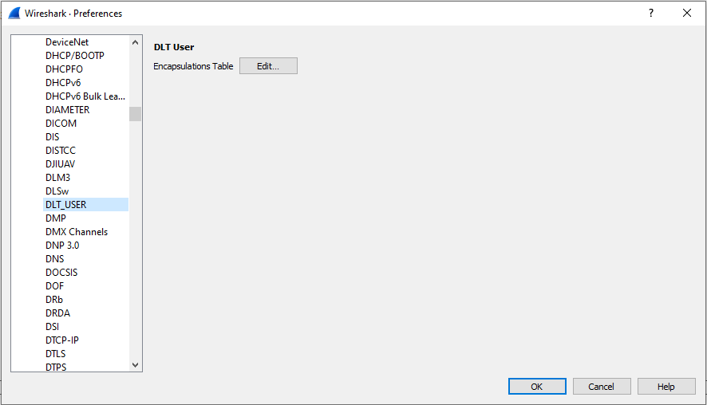
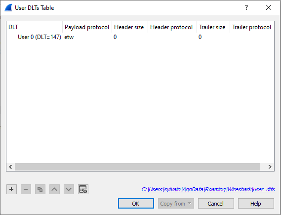
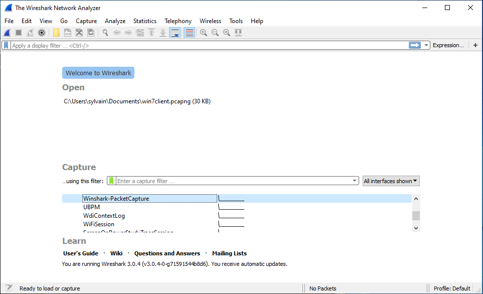
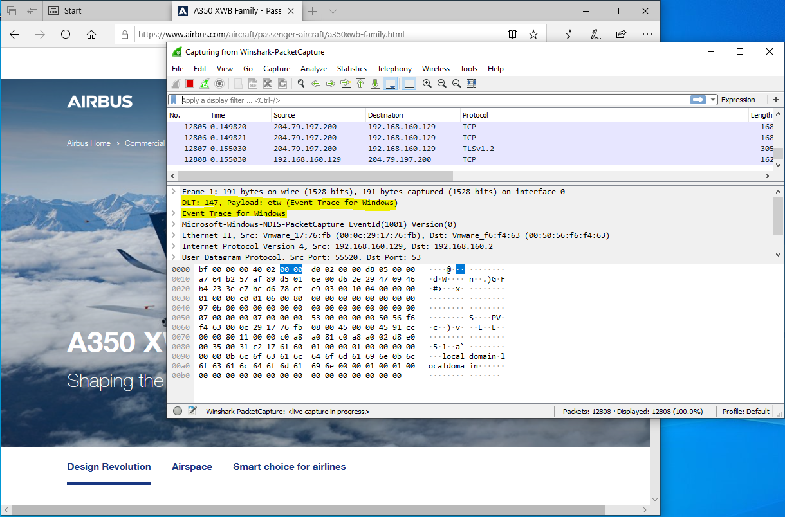

# Winshark
`Wireshark` plugins to work with Event Tracing for Windows

`Microsoft Message Analyzer` is being retired and its download packages removed from microsoft.com sites on November 25 2019. 
Wireshark have built a huge history of network protocol dissector.
The best tool for Windows would be one that can gather and mix all type of log... 

Welcome `Winshark`!!!

`Winshark` is based on a `libpcap` backend to capture ETW (Event tracing for Windows), and a generator that will produce all dissector for known ETW provider on your machine.
We've added Tracelogging support to conver almost all log technics on Windows Operating System.

With Winshark, and the powerfull of Windows, we can now capture network and event log in the same tools. Windows expose a lot of ETW provider, in particular one for network capture ;-) 
No more needs of an external NDIS driver.

This is a huge improvement in term of use :
* Enable to mix all kind of event (system and network)
* Enable to use wireshark filtering on event log
* Enable to track network and system log by Process ID !!!
* Enable to capture Windows log and network trace into an unique pcap file !!!

If you want to :
* [Capture Network Traffic Using Winshark](#Capture-Network-traffic)
* [Filtering on process id](#Filtering-on-process-id)

## Install

Please install [Wireshark](https://www.wireshark.org/download.html) before.
Then just install [Winshark](https://github.com/airbus-cert/Winshark/releases).

Actually, you have to ask `Wireshark` to interpret the DLT_USER 147 as ETW. This is because you have not yet a true value from `libpcap` for our new Data Link.
A pending request has been made to have a didicated DLT value
To do that you have to open `Preferences` tab under the `Edit` panel. Select `DLT_USER` under `Protocols` and `Edit` the encapsulations table :



And set `etw` for `DLT = 147` :


 
Enjoy !

## Build

Winshark is powered by `cmake` :

```
git clone https://github.com/airbus-cert/winshark --recurcive
mkdir build_winshark
cd build_winshark
cmake ..\Winshark
cmake --build . --target package --config release
```

## How does it work

To better understand how Winshark works, we need to understand how ETW work first.

ETW is splitted into three parts :
* Provider will emit log and identified by unique id
* Session will mix one or more provider
* Consumer that will read log emitted by a session

### Provider

It exist a lot of kind of provider. The most common, and exploitable, are registred provider. A registred provider, or a manifest based provider, are recorded under the registry key `HKLM\SOFTWARE\Microsoft\Windows\CurrentVersion\WINEVT\Publishers`.
This make the link between a provider id and a dll. The manifest is encompass into the associated dll into a ressources names `WEVT_TEMPLATE`.

You can list all providers registred on your machine using `logman` :

```
logman query providers
```

You can also list all providers binded by a particular process :

```
logman query providers -pid 1234
``` 

Some of them could appears without name, these kind of provider can produce [WPP](https://posts.specterops.io/data-source-analysis-and-dynamic-windows-re-using-wpp-and-tracelogging-e465f8b653f7) or [TraceLogging](https://posts.specterops.io/data-source-analysis-and-dynamic-windows-re-using-wpp-and-tracelogging-e465f8b653f7) log.

### Session

Session are created to collect logs from more than one provider. 
You can create your own session using `logman` :

```
logman start Mysession -p "Microsoft-Windows-RemoteDesktopServices-RdpCoreTS" -ets -rt
logman update MySession -p "Microsoft-Windows-NDIS-PacketCapture" -ets -rt
```

You can list all active session from an admin command line :

```
>logman query -ets

Data Collector Set                      Type                          Status
-------------------------------------------------------------------------------
...
EventLog-Application                    Trace                         Running
EventLog-Microsoft-Windows-Sysmon-Operational Trace                         Running
EventLog-System                         Trace                         Running
...
The command completed successfully.
```

You can see here some interesting session use by event logger to capture log from Application and System session and from Sysmon.

### Consumer

A consumer is a simple program that will read logs from a session. Famous consumer are :
* Event Logger
* logman
* netsh
* tracert

And now `Winshark` !!! `Winshark` is a simple ETW consummer. Underlying, the real consumer is `libpcap`, (`wpcap.dll` in case Windows) which is used by `dumpcap.exe` which is the process in charge of packet capture.

## Wireshark

`Wireshark` is splitted in three part (too) :
* `Wireshark.exe` which is in charge of parse and dissect protocol
* `dumpcap.exe` which is in charge of of packet capture
* `libpcap` (`wpcap.dll`) is in charge of interface between dumpcap.exe and the Operating System

`Winshark` take place in first and last part. It implement a backend for `libpcap` to capture ETW event. 
`Winshark` works on ETW session, this is why you can select ETW session in place of Network interface at the start of capture.
Then `Winshark` generate `lua` dissector for each manifest based provider registred on your computer, during installation step.
`Winshark` is also available to parse tracelogging based provider.

## Capture Network traffic

To capture network traffic using `Wineshark`, you have to simply activate network tracing through `netsh` :

```
netsh.exe trace start capture=yes report=no correlation=no
```

And then create an ETW session associate with the `Microsoft-Windows-NDIS-PacketCapture` provider :

```
logman start Winshark-PacketCapture -p "Microsoft-Windows-NDIS-PacketCapture" -rt -ets
```

Then launch `Wireshark` with administrator privileges and select `Winshark-PacketCapture` interface :



That will start the packet capture :



## Filtering on process id

ETW mark each packet with an header that set some meta information about the sender.
One of these is the `Process ID` of the emitter. In case of packet capture, this is a huge improvement from a classic packet capture from an NDIS driver.
Simply fill the filter field of wireshark with the following expression :

```
etw.header.ProcessId == 1234
```


## SSTIC (Symposium sur la sécurité des technologies de l'information et des communications)

This project is part of presentation made for [SSTIC](https://www.sstic.org/2020/presentation/quand_les_bleus_se_prennent_pour_des_chercheurs_de_vulnrabilites/)

